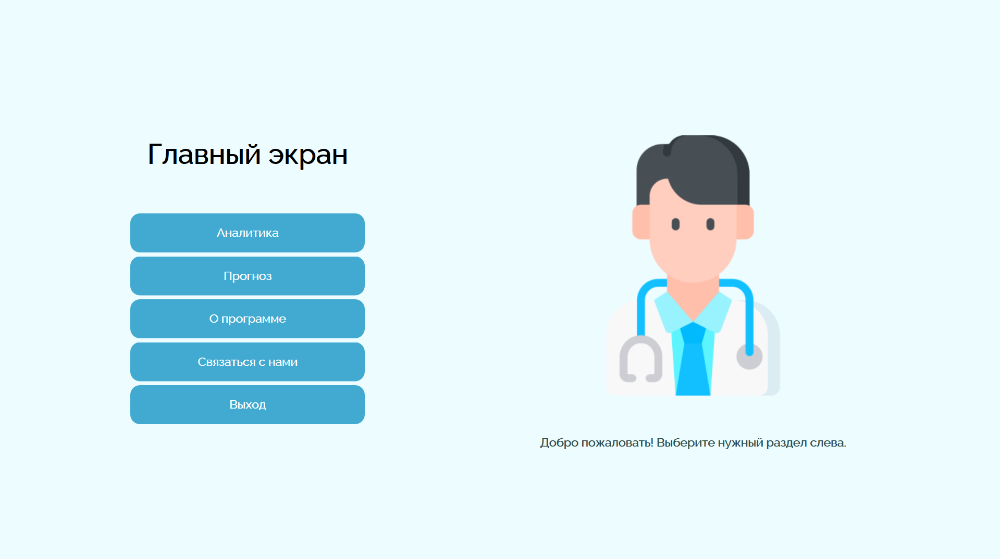
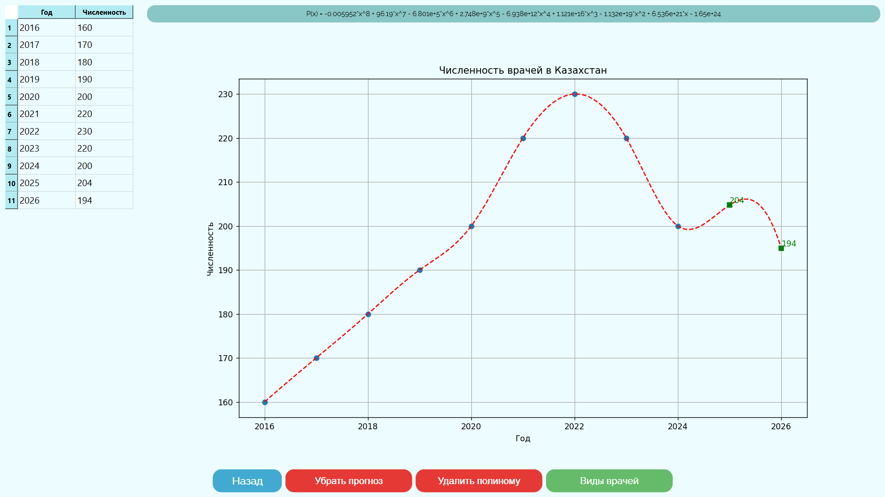

# Doctor Forecast App

## 📌 Description
**Doctor Forecast App** - is a Python (PyQt) application for visualizing and forecasting the number of doctors by country and specialty.
The app dynamically generates charts, allows specialty selection, and provides forecasts for upcoming years.

---

## ⚙️ Features
- Visualization of doctor statistics by country
- Dynamic charts with real-time data updates
- Selection of doctor specialties  
- Data interpolation and forecasting
- Automatic loading and saving of data from .json files  

---

## 🛠 Technologies
- Python  
- PyQt6  
- Matplotlib  
- NumPy  
- Работа с файлами `.json`
  
---

## 📸 Screenshots

### Main Window


### Forecast Graph


---

## 🚀 How to Run
1. Клонируйте репозиторий:  
```bash
git clone https://github.com/MynameisM1000/Doctor-Forecast-App.git
